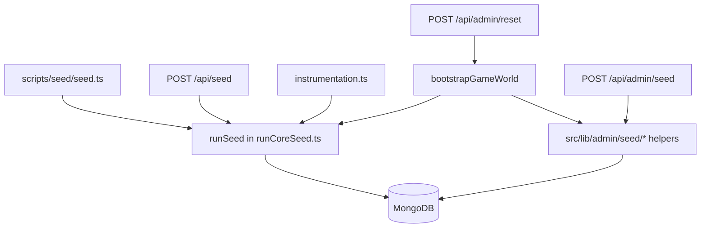

# Seed, admin seed API, setup, and bootstrap

This document summarizes **who calls what** for reference data and world bootstrap. It supports reset-hardening work (F-002): one orchestration story in `src/lib`, thin CLI/API wrappers.

## Layers

| Entry                                                            | Role                                                                                                                                                                                                                                                                   |
| ---------------------------------------------------------------- | ---------------------------------------------------------------------------------------------------------------------------------------------------------------------------------------------------------------------------------------------------------------------- |
| **`runSeed`** (`src/lib/admin/seed/runCoreSeed.ts`)              | US reference core: achievements, states, policies, demographics, game config, parties, metrics, baselines, legislation types (seed + admin permanent), budgets subset, indexes. Requires an injected `Db`.                                                             |
| **Per-target seeders** (`src/lib/admin/seed/*.ts`)               | Granular operations used by the admin Universal Seeder and by `bootstrapGameWorld` for UK and follow-on datasets (e.g. `seedUKRegions`, `seedBudgets`, `seedSeats`).                                                                                                   |
| **`POST /api/admin/seed`** (`src/app/api/admin/seed/route.ts`)   | Admin-only HTTP API: validates targets, calls lib seeders only (no handler logic in the route).                                                                                                                                                                        |
| **`POST /api/seed`** (`src/app/api/seed/route.ts`)               | Token-protected shortcut to **`runSeed`** only (full US core, not UK partial targets).                                                                                                                                                                                 |
| **`scripts/seed/seed.ts`**                                            | CLI: `connectDb` / `closeDb` + **`runSeed`**. Re-exports `runSeed` for legacy imports.                                                                                                                                                                                 |
| **`instrumentation.ts`**                                         | Optional auto-seed on startup: `getDb()` + **`runSeed({ db })`** when the Node runtime loads.                                                                                                                                                                          |
| **`/api/admin/setup`**                                           | Readiness checks and scoped repair seeds (separate from full bootstrap; see that route’s GET/POST).                                                                                                                                                                    |
| **`bootstrapGameWorld`** (`src/lib/admin/bootstrapGameWorld.ts`) | Reset/bootstrap orchestration: **`runSeed`** → UK + US extended seeders → `initializeGameState` → officials (historical or vacant) → perpetual / UK elections → regional council. Used by **`POST /api/admin/reset`** and scripts such as `scripts/bootstrap-full.ts`. |

## Call graph (simplified)

## Data location note

**Canonical US DB seed tables** (states, parties, legislation types, budgets, formula grants, etc.) live in **`src/lib/seeds/reference/`**. **`scripts/seeds/*.ts`** are thin re-exports so CLI scripts (`scripts/seed*.ts`, `simulate-*.ts`) can keep `./seeds/...` paths without duplicating data. Application and **`src/lib`** code should import **`@/lib/seeds/reference/*`** (not `scripts/`).
